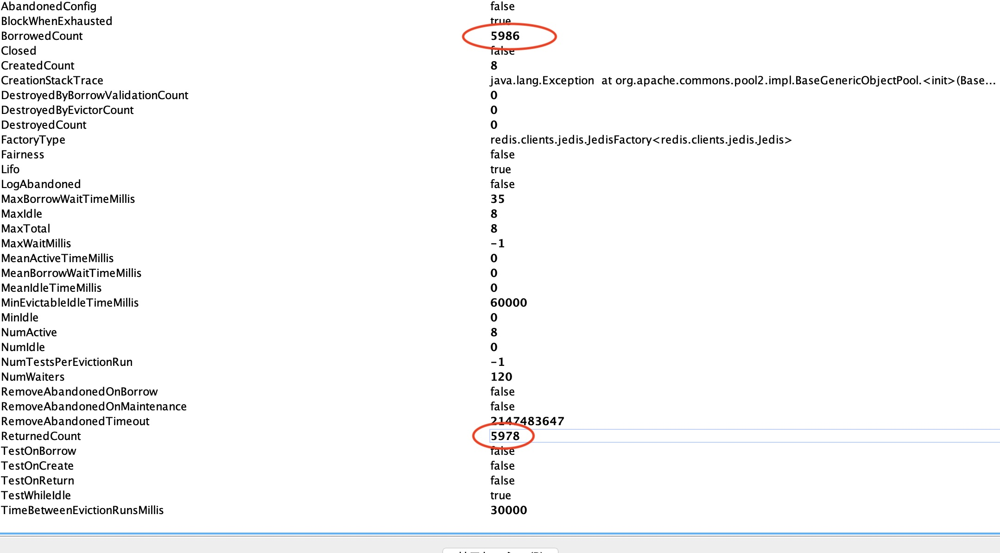

# jedis-cluster-pool-issue
a sample project to reproduce [this issue](https://github.com/xetorthio/jedis/issues/2068)

# issue
Using Spring-Data-Redis + Jedis to connect to a Redis Cluster, under high concurrency, threads are blocked forever in getting Jedis connection resource, even though all borrowed Jedis connections are supposed to be returned.

# versions
| software          | version|
|-------------------|:------:|
| spring-data-redis | 2.1.4  |
| jedis             | 2.9.1  |
| commons-pool2     | 2.6.0  |

# redis cluster
localhost:30001~30006

# command to reproduce
```
wrk -t60 -c60 -d10m http://localhost:8080/foo/
```

# result
we can see that threads are blocked in borrowing pool object. 
## stacktrace
[here](stacktrace.txt)

## jmx
seems sometimes the borrowed Jedis object did not get returned properly.
we can see this from the following image.


